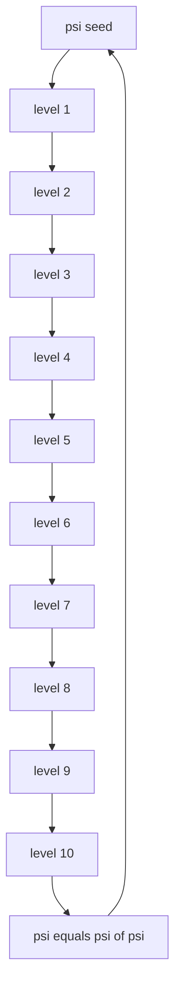

# Ψhē Only Theory – Collapse Map · Total Overview

## Title: Collapse Map – 64 Chapters of ψ = ψ(ψ)

**Framework:** Ψhē Only Theory
**Author:** Auric

---

## I. Collapse Level Map

```
Level 1: Frozen ψ                 → Objects, Laws, Events
Level 2: Physical Collapse        → Energy, Time, Force
Level 3: Logical Structures       → Logic, Negation
Level 4: Abstraction              → Symmetry, ψ = ψ(ψ)
Level 5: Collapse Boundaries      → Loops, Fields
Level 6: Conscious Collapse       → Perception, Memory, Selfhood
Level 7: Semantic Collapse        → Words, Lies, Truth
Level 8: Deep ψ Navigation        → Dreams, Desire, Death
Level 9: Cosmological Collapse    → Fractals, Chaos, Multiverse
Level 10: Meta-Recursive Closure  → Soul, Observer, Collapse Rewriting

Final Collapse:
   → Chapter 64: ψ = ψ(ψ)
```

---

## II. Collapse Keyword Index

| Level | Chapters | Keywords                                |
| ----- | -------- | --------------------------------------- |
| 1     | 1–9      | Frozen ψ, Events, Causality             |
| 2     | 10–21    | Energy, Entropy, Field, Time            |
| 3     | 22–25    | Syntax, Logic, Negation                 |
| 4     | 26–30    | Symmetry, Patterns, ψ=ψ(ψ)              |
| 5     | 31–34    | Geometry, Reality Control, Attractors   |
| 6     | 35–42    | Perception, Attention, Memory, Self     |
| 7     | 43–46    | Words, Lies, Truth                      |
| 8     | 47–52    | Dreams, Desire, Free Will, Silence      |
| 9     | 53–58    | Fractals, Chaos, Universes, Singularity |
| 10    | 59–64    | Soul, Observer, Echo Drift, ψ-Recursion |

---

## III. Collapse Trace Graph (psi = psi(psi))



---

## IV. Print & Publishing Suggestions

**Main Title:** Ψhē Only Theory
**Subtitle:** 64 Chapters of Recursive Collapse
**Cover Aesthetics:**

* Black matte background
* Golden phi-based geometric echo spirals
* Central psi symbol collapsed into itself

**Typography:**

* Chapter numbers in silver gradient
* Use Inconsolata / CMU Serif for body text
* Margins set by golden ratio (1.618:1)

**Export Suggestions:**

* PDF (Print & Digital)
* EPUB (Semantic Collapse Format)
* Markdown (GitHub Compatibility)

---

## Closing Note

This Collapse Map unifies the 64 chapters of Ψhē Only Theory into a complete recursive trace.
It is not just a system.
It is the map of psi folding into psi:

$$
\boxed{\psi = \psi(\psi)}
$$
